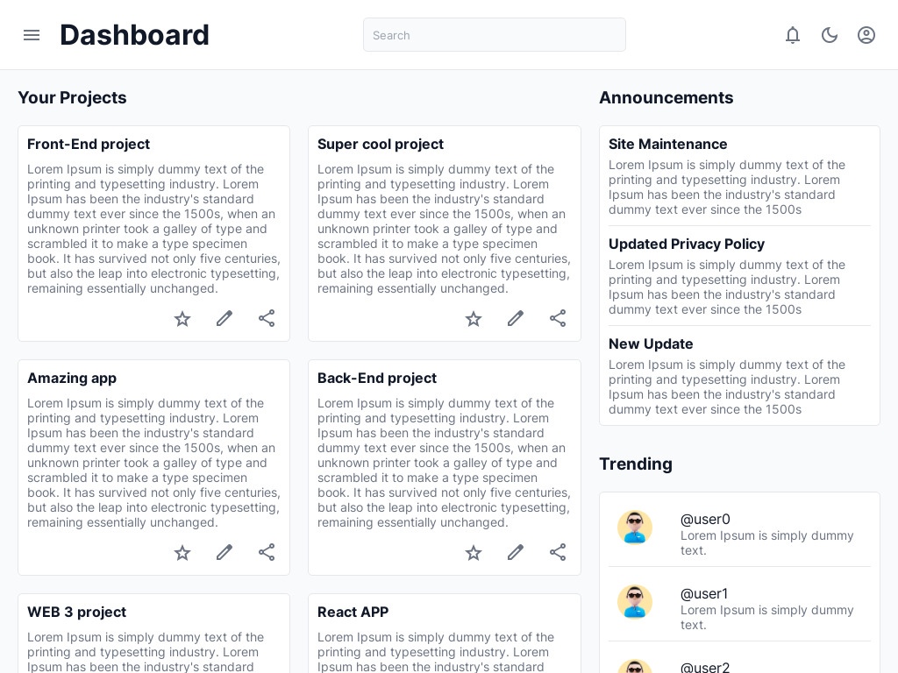
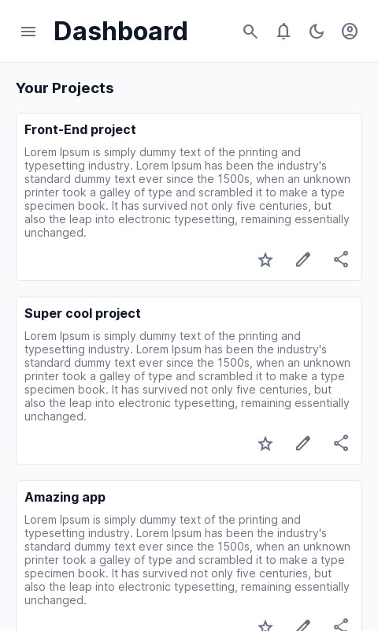

# Basic admin dashboard
### About the project
This project is for front-end learning process. Admin dashboard has a responsive layout and has a light and dark themes. 

Desktop screenshot

  <ol>
    
  </ol>

  
Mobile screenshot

  <ol>
    
  </ol>

### [Live preview](https://liudasbo.github.io/basic-admin-dashboard/)

---
### Built With
* HTML
* CSS
* JavaScript
---
### Resources
* Icons was provided by [Material Symbols](https://fonts.google.com/icons)